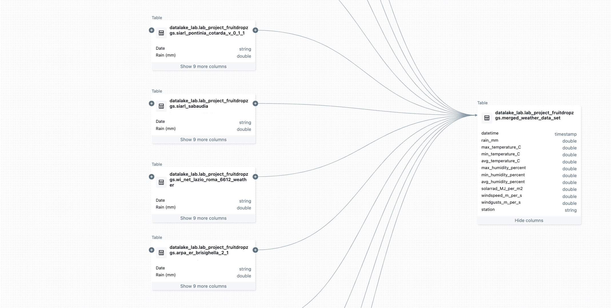
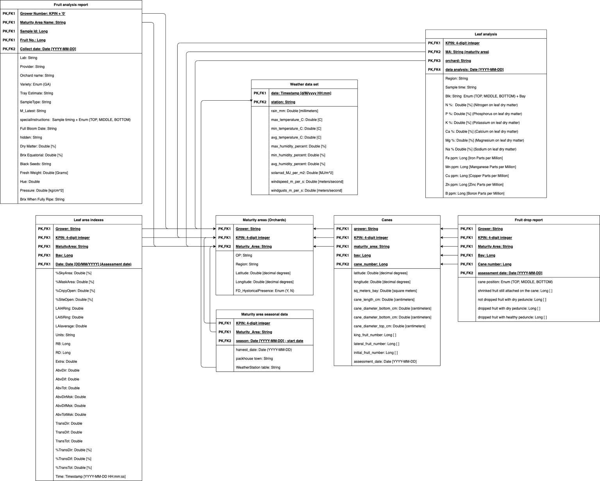

# Kiwifruit Drop Analysis in Italy

## Project Overview

This project focuses on the development of an automated data pipeline and ETL process using Spark SQL on Databricks for analyzing kiwifruit drop data in various orchards across Italy. The objective is to streamline data analysis and machine learning operations to better understand the factors contributing to kiwifruit drop and to develop predictive models for future seasons.

## Data Sources

### The data for this project includes:

	•	Environmental metrics (e.g., weather data)
	•	Physiological metrics (e.g., leaf area index, cane features)
	•	Survey data from orchards

 Note: The actual data used in this project is not shown on GitHub due to privacy and confidentiality reasons.
 
## Tools and Technologies

	•	Databricks: For data analytics and modeling
	•	Spark SQL: For ETL processes
	•	Jupyter: For interactive analysis and modeling
	•	MLflow: For tracking and comparing experiments

## Data Lineage and Preprocessing

The weather data lineage involves merging multiple raw weather datasets after preprocessing the data. Below is a diagram showing the weather data lineage and preprocessing steps:

## Entity Relationship Diagram (ERD)

The ERD was designed to understand how different data entities should be joined together to achieve comprehensive metrics for each KPIN, maturity area, bay, and cane. The diagram illustrates the relationships between various data sets and their corresponding metrics.

## Data Analysis and Findings

### Key Findings

	•	Skewed distribution of kiwifruit drop across orchards
	•	High fruit drop rates reported after September 1, 2023
	•	Significant variation in leaf area index and fruit drop relationship
	•	Weather metrics indicate high temperatures and vapour pressure deficit affecting fruit drop

### Recommendations

	•	Standardize data collection processes across all orchards
	•	Collect as much data as possible during the 2024 season
	•	Avoid manual data processing to reduce errors
